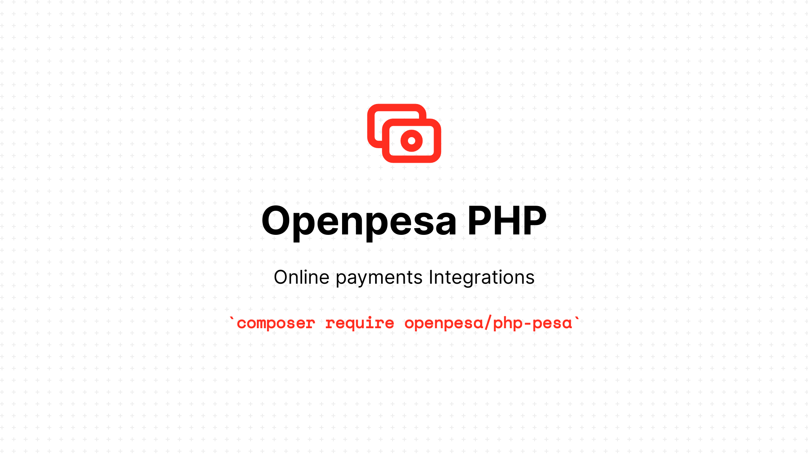

<p align="center"></p>
<h1 align="center">Pesa SDK for PHP</h1>


[](https://packagist.org/packages/openpesa/pesa)


[](https://hits.seeyoufarm.com)
[](https://codecov.io/github/openpesa/php-pesa)
[](https://packagist.org/packages/openpesa/pesa)


The **Pesa SDK for PHP** makes it easy for developers to access [OpenAPI](https://openapiportal.m-pesa.com/) in their PHP code, and build robust applications and software using services like Customber 2 Bussiness, Query etc.

## Documentation

Take a look at the [API docs here](https://openpesa.github.io/php-pesa/).

## Getting Started

1. **Sign up for OpenAPI Portal** – Before you begin, you need to
   sign up for an account and retrieve your credentials.

1. **Minimum requirements** – To run the SDK, your system will need to meet the
   [minimum requirements](https://openpesa.github.io/php-pesa/guide/installation#system-requirements), including having **PHP >= 7.1**.
     <!-- We highly recommend having it compiled with the cURL extension and cURL
     7.16.2+ compiled with a TLS backend (e.g., NSS or OpenSSL). -->
1. **Install the SDK** – Using [Composer] is the recommended way to install the
   Pesa SDK for PHP. The SDK is available via [Packagist] under the
   [`openpesa/php-pesa`](https://packagist.org/packages/openpesa/pesa) package. If Composer is installed globally on your system, you can run the following in the base directory of your project to add the SDK as a dependency:
    ```sh
    composer require openpesa/pesa
    ```
    Please see the
    [Installation section of the User Guide](https://openpesa.github.io/php-pesa/guide/installation) for more
    detailed information about installing the SDK through Composer and other
    means.
1. **Using the SDK** – The best way to become familiar with how to use the SDK
   is to read the [User Guide](https://openpesa.github.io/php-pesa/guide/quick_guide).

     <!-- The [Getting Started Guide](#) will help you become familiar with
     the basic concepts. -->

## Usage

### Quick Examples

```php

require 'vendor/autoload.php';

use Openpesa\Sdk\Mpesa;
use Openpesa\Sdk\Config\Configuration;

$config = Configuration::create([
    'api_key' => 'YOUR_API_KEY',
    'public_key' => 'PUBLIC_KEY',
    'currency' => 'TZS',
    'country' => 'TZN',
    'service_provider_code' => 'YOUR_SERVICE_PROVIDER_CODE',
]);

$mpesa = new Mpesa($config);

// Request collection
$result = $mpesa->collection()->request([
    'amount' => 10_000,
    'phone' => '255766303775',
]);

// Print results
print_r($result);
```
### Testing

Using [Pest](#)

```bash
composer test
```

## Opening Issues

If you have a feature request or you encounter a bug, please file an issue on [our issue tracker on GitHub](https://github.com/openpesa/php-pesa/issues).

## Resources

* [User Guide](https://openpesa.github.io/php-pesa/) – For both getting started and in-depth SDK usage information
* [Issues](https://github.com/openpesa/php-pesa/issues) – Report issues, submit pull requests, and get involved
* [@openpesa](https://twitter.com/openpesa) – Follow us on Twitter

### Changelog

Please see [CHANGELOG](CHANGELOG.md) for more information what has changed recently.

## Contributing

Please review our [CONTRIBUTING](CONTRIBUTING.md) for details.

### Security

If you discover any security related issues, please email [alphaolomi@gmail.com](mailto:alphaolomi@gmail.com) instead of using the issue tracker.

## Credits

-   [Alpha Olomi](https://github.com/openpesa)
-   [Ley](https://github.com/leyluj)
-   [All Contributors](../../contributors)

## License

The MIT License (MIT). Please see [License File](LICENSE.md) for more information.
